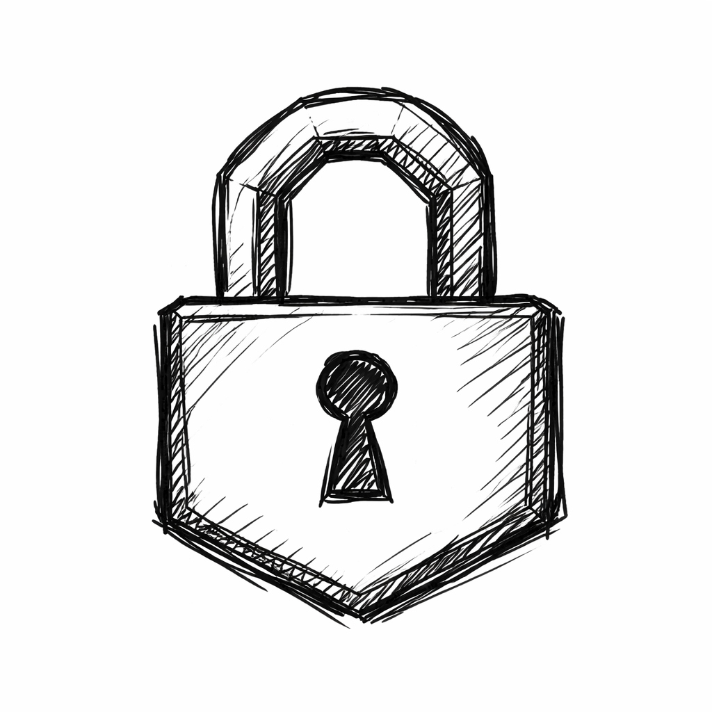
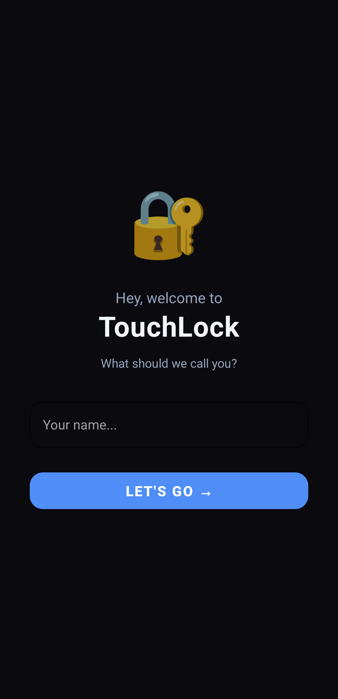
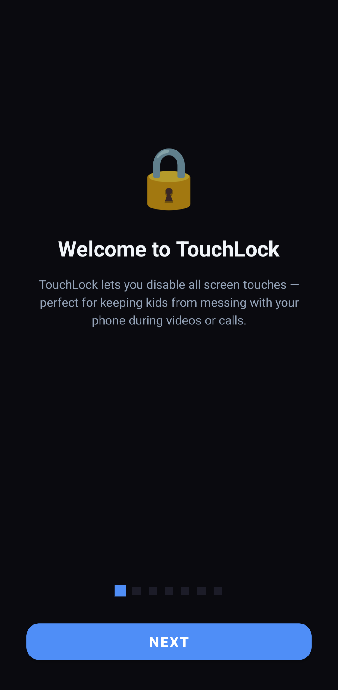
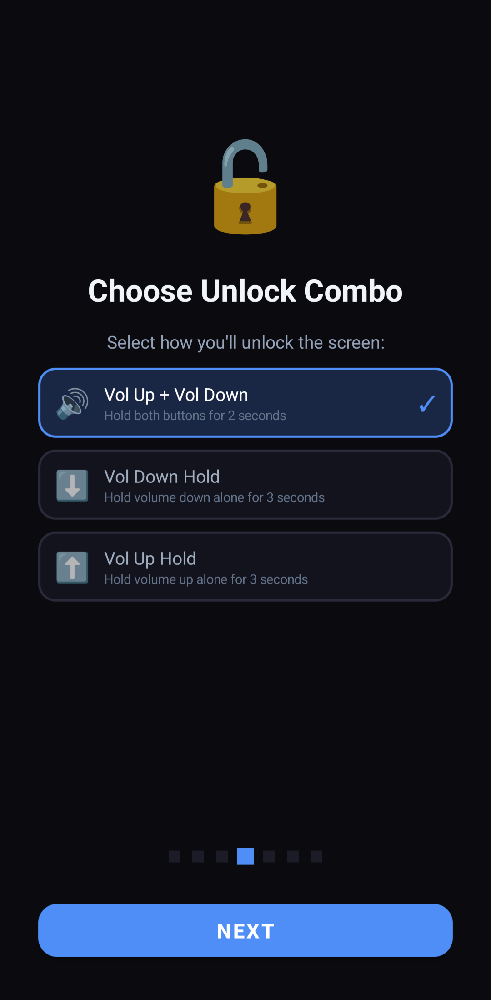
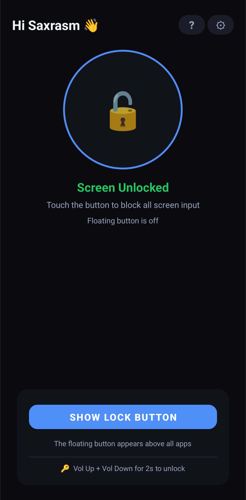
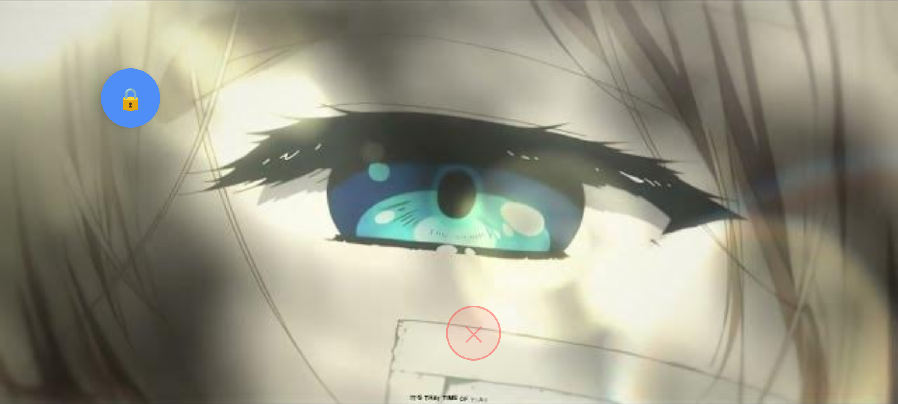

  
  <h1>🔒 TouchLock</h1>
  
<strong>A smart, invisible shield against accidental touches.</strong>

   
  <!-- Use this if distributing via your GitHub Releases page: -->
  

 

> [!NOTE]
> **What is TouchLock?**  
> TouchLock is a specialized Android utility designed to completely block touch input on your screen while remaining fully transparent. Whether you are handing your phone to a toddler to watch a video, or keeping an active app running safely in your pocket, TouchLock ensures your content plays uninterrupted.

---

## 📸 Screenshots

  
  
  
  
  

---

## ✨ Premium Features

> [!TIP]
> **Secret Hardware Unlocking**
> Say goodbye to standard on-screen PIN codes that kids can easily mash. TouchLock uses physical button combinations that only you know about to unlock the screen.

* 🛡️ **Invisible Touch Blocking:** A transparent, full-screen overlay blocks all touch input while the underlying video or app continues to play perfectly.
* 🚦 **Hardware Key Interception:** Automatically intercepts and blocks physical `Home`, `Back`, and `Recents` buttons to prevent accidental app switching.
* 🎛️ **Custom Unlock Combos:** Choose from three hidden combinations:
  * **Volume Up + Volume Down** (Hold for 2 seconds)
  * **Volume Up** (Hold for 3 seconds)
  * **Volume Down** (Hold for 3 seconds)
* ☀️ **Screen Awake Override:** Keep the screen wide awake while the lock is active, bypassing the system's normal sleep timeout.
* 🔋 **Power-Cycle Resilient:** The lock state smartly persists even if the power button is pressed, ensuring the device remains secure when the screen wakes back up.

---

## 📱 How It Works

TouchLock pairs its invisible overlay with Android's native systems to create an inescapable environment.

> [!IMPORTANT]
> **The Ultimate Navigation Lock**  
> Because modern gesture navigation is deeply embedded into Android, TouchLock uses a guided setup to walk you through utilizing Android's native **"App Pinning."** This completely locks the gesture navigation so users can't swipe home or back.

### The 3-Step Setup

| Step | Action | Description |
| :---: | :--- | :--- |
| **1** | 📌 **Pin the App** | Open your target app (e.g. YouTube), open your Recents screen, and use Android's native "Pin" feature. |
| **2** | 🔒 **Engage Lock** | Tap the floating TouchLock badge. The invisible shield will activate, blocking all taps and swipes. |
| **3** | 🔓 **Regain Control** | Perform your secret Volume Key combo to drop the shield! |

---

> [!WARNING]
> This repository is a feature showcase and does not contain the inner source code of the proprietary engine.

